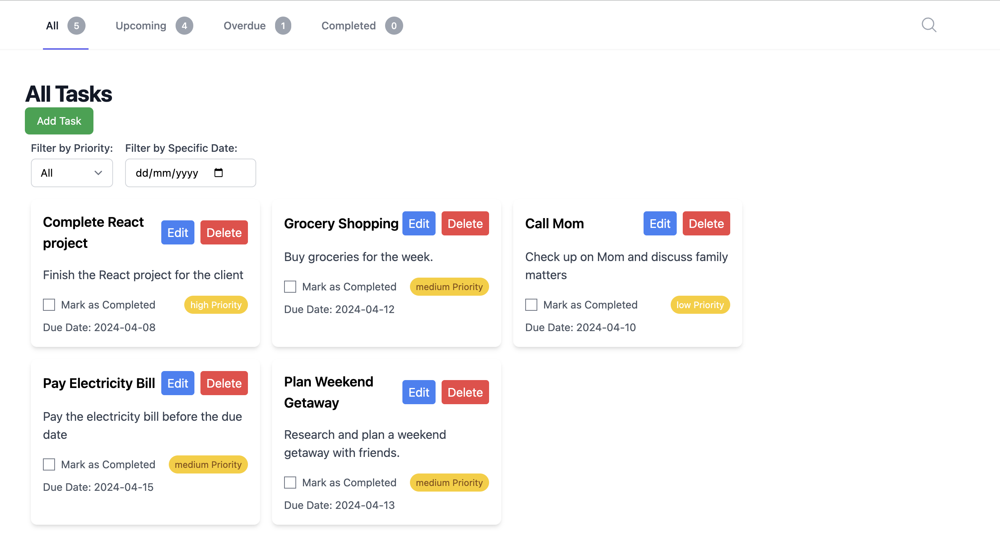
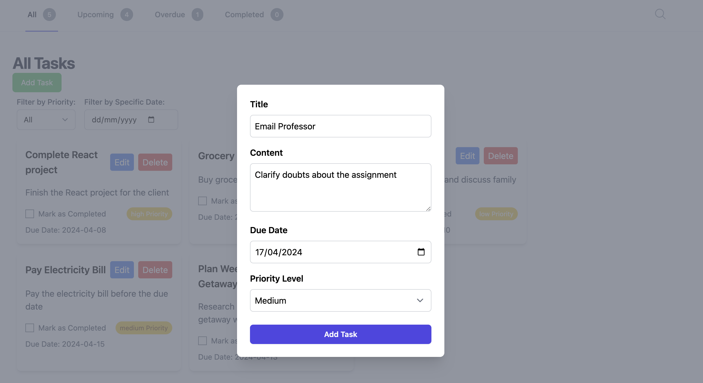
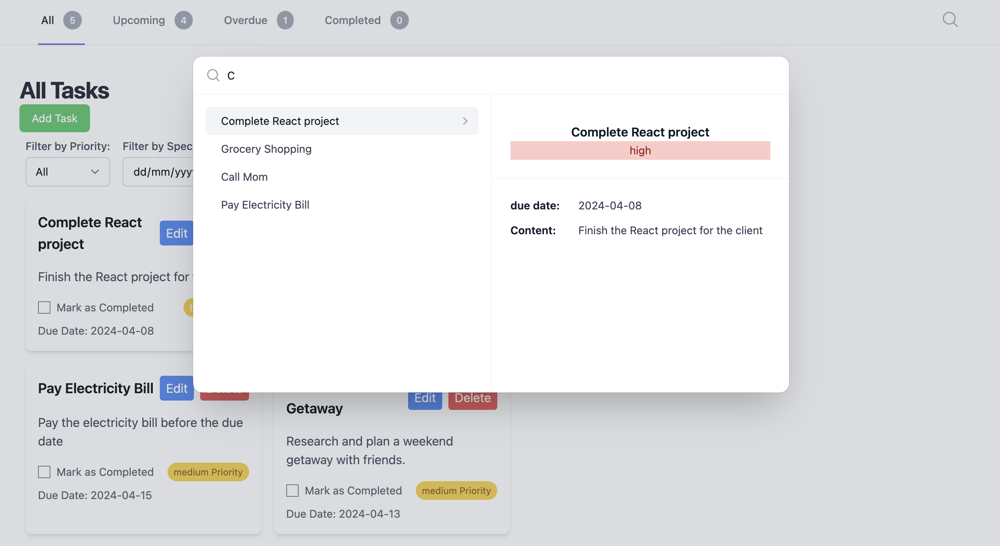

# TaskEase

## Objective
The TaskEase App is a straightforward task management application, with an emphasis on core functionality and a user-friendly interface, built ontop of [React Framework](https://github.com/facebook/create-react-app), with backend storage using [LocalStorage](https://developer.mozilla.org/en-US/docs/Web/API/Window/localStorage), with [TailwindCSS](https://tailwindcss.com/) as design.

Link to Figma Wireframe [here](https://www.figma.com/file/ZlLaVOqbDfeVnTiR8NVREP/Task-Manager-Figjam-Wireframe?type=whiteboard&node-id=568%3A521&t=c0DRCB6FRSXQiATp-1).

## Screenshoots







## Installation
- Clone the repository: git clone <repository-url>
- Navigate to the project directory: cd frontend
- Install dependencies: npm install
- Start the development server: npm start
- Access the application in your browser at http://localhost:3000

## Available Scripts

In the project directory, you can run:

### `npm start`

Runs the app in the development mode.\
Open [http://localhost:3000](http://localhost:3000) to view it in your browser.

The page will reload when you make changes.\
You may also see any lint errors in the console.

### `npm run build`

Builds the app for production to the `build` folder.\
It correctly bundles React in production mode and optimizes the build for the best performance.

The build is minified and the filenames include the hashes.\
Your app is ready to be deployed!

See the section about [deployment](https://facebook.github.io/create-react-app/docs/deployment) for more information.

## Core Features
Built core features under 4-5 hours.

### Dashboard
- Upon accessing the application, users see a basic dashboard displaying a list of tasks.
- Includes sections for upcoming tasks, overdue tasks, and completed tasks.

### Task Management
- Users can add, edit, and delete tasks.
- Tasks include a title, description, due date, and priority level.

### Priority Levels
- Define three priority levels for tasks (e.g., High, Medium, Low).
- Users can set and update the priority of each task.

### Search and Filter
- Implement a search functionality to find tasks quickly.
- Allow users to filter tasks based on priority and completion status.

## Technical Requirements
### Frontend
- Utilized the React framework.
- Implemented a simple and clean user interface.

### Local Storage
- Task data is stored locally using browser storage (localStorage).

## Code Snippet
```jsx
// Function to filter tasks based on the selected option
useEffect(() => {
  let updatedTasks = tasks;

  if (filterOption === 'Completed') {
    updatedTasks = tasks.filter(task => task.isCompleted);
  } else if (filterOption === 'Overdue') {
    const today = new Date();
    updatedTasks = tasks.filter(task => new Date(task.dueDate) < today);
  } else if (filterOption === 'Upcoming') {
    const today = new Date();
    updatedTasks = tasks.filter(task => new Date(task.dueDate) >= today);
  }

  if (priorityFilter !== 'All') {
    updatedTasks = updatedTasks.filter(task => task.priority === priorityFilter.toLowerCase());
  }

  if (specificDate) {
    updatedTasks = updatedTasks.filter(task => {
      const dueDate = new Date(task.dueDate);
      return dueDate.toDateString() === new Date(specificDate).toDateString();
    });
  }

  setFilteredTasks(updatedTasks);
}, [tasks, filterOption, priorityFilter, specificDate]);
```

### Performance Issue Tracking

In production, if there's a performance issue, I would:
- Use performance monitoring tools to identify bottlenecks.
- Analyze server logs and database queries for any anomalies.
- Implement caching mechanisms to reduce server load.
- Optimize code for efficiency, such as using memoization or lazy loading.

## Upcoming Features/Improvements
I would consider adding:
- Date range filtering for tasks.
- Inline editing for tasks.
- Improved layout in a kanban-style approach.
- Enhanced filtering options, including date ranges.
- Ability to create sub-tasks for each task.
- Improve Search View
- Keyboard shortcuts